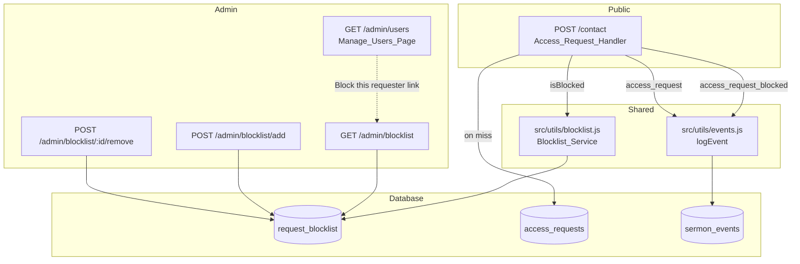

# Design Document

## Overview

The request blocklist adds a database-backed allow/deny check between the public access-request form (`POST /contact`) and the `access_requests` table. Each blocklist entry targets a single Access_Request field (`email` or `name`), can be a literal string or a JavaScript regular expression, and is owned and managed by Admins through a new admin page at `/admin/blocklist`. Blocked submissions are silently dropped: they render the same success view as accepted submissions, do not insert into `access_requests`, and do not emit an `access_request` event. A separate `access_request_blocked` event is recorded so admins can audit blocking activity from the existing activity log.

The feature is split into three concerns to keep responsibilities narrow:

1. A pure matching module (`Blocklist_Service`) that knows how to load entries and decide whether a request matches.
2. A new admin sub-router (`Blocklist_Manager`) that lists, adds, and removes entries through Pug-rendered pages and form posts.
3. A small change to the existing `Access_Request_Handler` (`src/routes/contact.js`) that calls the service before persisting.

The schema lives in migration 011, which already exists but has not been run yet. The design relies on that schema as-is; no further DDL changes are introduced.

## Steering Compliance

This project does not have a `.kiro/steering/` directory, so no project-specific steering rules apply. The design follows the conventions visible in the surrounding codebase:

- Routes live under `src/routes/` with admin sub-routers in `src/routes/admin/` mounted from `src/routes/admin.js`.
- Shared logic lives in `src/utils/`.
- Views are Pug templates in `src/views/admin/`.
- Authorization uses `requireRole('admin')` from `src/middleware/auth.js`.
- Auditable actions are logged via `logEvent` from `src/utils/events.js`.
- All database access goes through the shared `pg` pool exported from `src/db/pool.js`.

## Architecture

### Component Layout



The flow on `POST /contact`:

1. Validate the form fields (existing `express-validator` chain).
2. Call `Blocklist_Service.findMatchingBlock({ name, email })`.
3. If a match is returned, call `logEvent('access_request_blocked', ...)` and render the existing success view. Skip the `access_requests` insert and the `access_request` event.
4. Otherwise, perform the existing insert and event log, then render the success view.

### Why a Separate Service Module

`Blocklist_Service` is implemented as a stateless module with two exported functions. Keeping it separate from the route handlers lets the contact route and the admin route share a single source of truth for what counts as a match, and it confines the regex-compilation try/catch to one place. There is no caching layer in this revision: the table will remain very small (a handful of rows) and one extra `SELECT` per access-request submission is negligible against the rest of the request lifecycle, which already includes session-store reads, validation, and (on miss) two writes.

### Why Mount as a New Sub-Router

The existing `src/routes/admin/misc.js` already aggregates unrelated administrative routes (leaderboard, birthday messages, activity log, PDF proxy). Adding three more endpoints for an unrelated feature would push that file further toward a junk drawer. A dedicated `src/routes/admin/blocklist.js` keeps the feature self-contained, mirroring the structure of `users.js`, `sermons.js`, etc., and makes future changes (an in-memory cache, a "test pattern" tool, a "last matched at" column) trivial to add without touching unrelated routes.

## Components and Interfaces

### Blocklist_Service — `src/utils/blocklist.js`

A new module exporting two functions.

```javascript
/**
 * Look up a Blocklist_Entry that matches the given access request.
 * Returns the matching row's id, or null if none matched.
 *
 * @param {{ name: string, email: string }} req
 * @returns {Promise<number|null>}
 */
async function findMatchingBlock(req) { /* ... */ }

/**
 * Validate that a string is a compilable JavaScript regular expression.
 * Returns the SyntaxError message on failure, or null on success.
 *
 * @param {string} pattern
 * @returns {string|null}
 */
function validateRegex(pattern) { /* ... */ }

module.exports = { findMatchingBlock, validateRegex };
```

`findMatchingBlock` performs a single `SELECT id, block_type, pattern, is_regex FROM request_blocklist` and walks the rows in JavaScript:

- For each row, pick the candidate value: `email` if `block_type === 'email'`, otherwise `name`.
- Normalize the candidate by trimming and lower-casing.
- Literal entry: declare a match when the trimmed, lower-cased pattern is strictly equal to the normalized candidate.
- Regex entry: attempt `new RegExp(pattern, 'i')`. On `SyntaxError`, write `console.error('Blocklist regex compile failed for entry ' + id + ': ' + err.message)` and continue with the next entry. On success, declare a match when the compiled expression's `test` returns `true` for the un-normalized candidate (regex authors are responsible for their own anchors and casing — they get the case-insensitive flag for free but otherwise see the trimmed input).
- Return the first matching entry's `id` and stop iterating. Return `null` if no row matches.

`validateRegex` simply runs `new RegExp(pattern)` inside a `try/catch` and returns the error message string on failure or `null` on success. It is used by the add-entry handler before insertion.

### Blocklist_Manager — `src/routes/admin/blocklist.js`

A new Express router exporting three routes, all guarded by `requireRole('admin')`:

| Method | Path           | Purpose                                                  |
| ------ | -------------- | -------------------------------------------------------- |
| GET    | `/`            | Render the management page (list + add form).            |
| POST   | `/add`         | Validate input, insert row, redirect back with flash.    |
| POST   | `/:id/remove`  | Delete row by id, redirect back with flash.              |

The router is mounted from `src/routes/admin.js` with:

```javascript
router.use('/blocklist', require('./admin/blocklist'));
```

The `GET /` handler:

1. Loads all entries with their creator's display name:
   ```sql
   SELECT b.id, b.block_type, b.pattern, b.is_regex, b.reason,
          b.created_at, u.display_name AS created_by_name
   FROM request_blocklist b
   LEFT JOIN users u ON b.created_by = u.id
   ORDER BY b.created_at DESC
   ```
2. Reads optional pre-fill query parameters `prefill_email`, `prefill_name`, `prefill_type`.
3. Reads and clears `req.session.flash`.
4. Renders `admin/blocklist` with `entries`, `prefill`, and `flash`.

The `POST /add` handler:

1. Trims `pattern` and `reason`. Coerces `is_regex` to boolean (form checkbox).
2. Validates: `block_type` ∈ `{'email', 'name'}`; `pattern` length 1–500 after trim; `reason` length ≤ 500; if `is_regex`, run `validateRegex(pattern)` and reject with the engine error on failure.
3. On any validation failure, re-renders `admin/blocklist` with the entries list, the submitted form values pre-filled, and an `error` message describing what was wrong. Does not redirect (so the form preserves the user's input).
4. On success, attempts the insert. If the `UNIQUE(block_type, pattern)` constraint fires (Postgres error code `23505`), re-renders with an error identifying the duplicate. Otherwise, sets `req.session.flash = { type: 'success', message: 'Added block "<pattern>".' }` and redirects to `/admin/blocklist`.

The `POST /:id/remove` handler:

1. Parses `id` as an integer.
2. Runs `DELETE FROM request_blocklist WHERE id = $1 RETURNING pattern`.
3. If `rowCount === 0`, sets `req.session.flash = { type: 'error', message: 'That block could not be found.' }` and redirects.
4. Otherwise, sets `req.session.flash = { type: 'success', message: 'Removed block "<pattern>".' }` and redirects.

### Access_Request_Handler — `src/routes/contact.js` (modified)

The existing `POST /` handler gets a single new step inserted between validation and the `INSERT INTO access_requests`:

```javascript
const { findMatchingBlock } = require('../utils/blocklist');
// ... inside the handler, after validation passes and after destructuring name/email/role/message:
const matchedId = await findMatchingBlock({ name, email });
if (matchedId !== null) {
  await logEvent(
    'access_request_blocked',
    'Blocked access request from ' + name,
    'Email: ' + email + '; matched blocklist entry ' + matchedId,
    null,
    null
  );
  return res.render('contact', {
    error: null,
    success: 'Thanks! Your request has been sent. We\'ll be in touch soon.',
    pageTitle: 'Join the Team',
  });
}
// ... existing INSERT + access_request logEvent + render success ...
```

The success message text is copied verbatim from the existing handler so the rendered page is byte-identical to the accepted-submission case.

If `findMatchingBlock` itself throws (database connectivity failure), the handler falls into the existing outer `try/catch` and renders the generic error message. This means a Postgres outage will not silently let blocked spam through — it will produce a user-visible error just as it currently does for accepted requests.

### Manage_Users_Page — `src/views/admin/users.pug` (modified)

A new control is added to the actions column of each pending Access_Request row, immediately after the existing Approve and Deny buttons:

```jade
a.btn.btn--small.btn--outline(
  href=`/admin/blocklist?prefill_type=email&prefill_email=${encodeURIComponent(r.email)}`
  data-tooltip='Pre-fill the blocklist add form with this email')
  ⛔ Block
```

Activating the link navigates to the blocklist page with the add form pre-filled. The admin reviews the values (and may toggle `is_regex` or add a reason) and submits the form themselves. This avoids creating a destructive cross-page POST and matches the codebase's convention of letting the admin confirm any auditable action.

### Blocklist_Page — `src/views/admin/blocklist.pug` (new)

The page has three regions:

1. **Header** — title, divider, short description.
2. **Add form** — a single `<form method="POST" action="/admin/blocklist/add">` with:
   - `block_type` select (`email`, `name`), defaulting to `prefill.type` or `email`.
   - `pattern` text input (max length 500), defaulting to `prefill.email` or `prefill.name`.
   - `is_regex` checkbox.
   - `reason` text input (max length 500).
   - Submit button.
   - Error banner above the form, rendered when `error` is present (validation or duplicate). Uses the existing `.alert.alert--error` styling visible in `auth/login.pug` and similar.
3. **Existing entries table** — columns: pattern, type (badge), regex flag (✓ or —), reason, added by, added on, remove button. The remove button is a small `<form method="POST" action="/admin/blocklist/:id/remove">` consistent with the deactivate/activate pattern in `users.pug`. Empty state: a single row with "No entries yet."

A success/error flash banner is rendered at the top when `flash` is present, mirroring the pattern used elsewhere (`success` and `error` template locals).

### Admin_Dashboard — `src/views/admin/dashboard.pug` (modified)

The Administration card already lists Users, Activity Log, Birthday Messages, and Create Account. Add one more link:

```jade
a.btn.btn--outline(href='/admin/blocklist') Blocklist
```

This places the management page exactly where an admin would look for it.

## Data Models

### request_blocklist (existing schema, no changes)

| Column      | Type           | Notes                                            |
| ----------- | -------------- | ------------------------------------------------ |
| id          | SERIAL PK      | Surrogate id used by the remove endpoint.        |
| block_type  | VARCHAR(20)    | `'email'` or `'name'`. Indexed.                  |
| pattern     | VARCHAR(500)   | Literal string or regex source.                  |
| is_regex    | BOOLEAN        | Default `false`.                                 |
| reason      | VARCHAR(500)   | Nullable. Free-form note for the admin.          |
| created_by  | INTEGER FK     | References `users(id)`. NULL on creator delete.  |
| created_at  | TIMESTAMPTZ    | Defaults to `NOW()`.                             |
| —           | UNIQUE         | Composite on `(block_type, pattern)`.            |

The composite unique constraint is what makes Requirement 1.3's duplicate-rejection behavior trivial — a `23505` Postgres error from `INSERT` is the signal.

### sermon_events (existing schema, used as-is)

A new value, `'access_request_blocked'`, is added to the de-facto enum of `event_type` strings logged by `logEvent`. The schema does not enforce a check constraint on `event_type`, so this requires no migration. The existing `admin/activity` page renders any event type generically.

### Session

A new transient field `req.session.flash` is used by the Blocklist_Manager to carry a one-shot message across redirects:

```javascript
req.session.flash = { type: 'success' | 'error', message: string };
```

The `GET /admin/blocklist` handler reads and immediately deletes the field. No schema change is needed; sessions are already persisted in `connect-pg-simple`.

## Error Handling

| Failure mode                                         | Component                | Behavior                                                                                                                         |
| ---------------------------------------------------- | ------------------------ | -------------------------------------------------------------------------------------------------------------------------------- |
| Database unavailable during `findMatchingBlock`      | Access_Request_Handler   | Outer `try/catch` renders the existing "Something went wrong…" error page. Submission is neither stored nor blocked.             |
| Regex entry has uncompilable pattern                 | Blocklist_Service        | `console.error` with the entry id, skip the entry, continue evaluating remaining entries (Requirement 3.5).                      |
| Add form submitted with invalid `block_type`         | Blocklist_Manager        | Re-render with error "Block type must be 'email' or 'name'." and the user's other inputs preserved.                              |
| Add form submitted with empty or oversize `pattern`  | Blocklist_Manager        | Re-render with error "Pattern is required and must be at most 500 characters." and the user's other inputs preserved.            |
| Add form submitted with oversize `reason`            | Blocklist_Manager        | Re-render with error "Reason must be at most 500 characters." and the user's other inputs preserved.                             |
| Add form submitted with regex pattern that won't compile | Blocklist_Manager   | Re-render with error "Invalid regex: <engine message>." and the user's other inputs preserved (Requirement 6.3).                 |
| Add form submitted with duplicate `(block_type, pattern)` | Blocklist_Manager   | Insert raises Postgres `23505`; re-render with error "A block with this pattern already exists." (Requirement 1.3).              |
| Remove submitted for nonexistent id                  | Blocklist_Manager        | `DELETE` returns `rowCount === 0`; flash an error and redirect (Requirement 5.3).                                                |
| Non-admin user requests any blocklist route          | `requireRole('admin')`   | Existing middleware renders the 403 page (Requirements 4.3, 5.4, 6 implied, 9.2).                                                |
| `logEvent('access_request_blocked', ...)` itself fails | logEvent (existing)    | Existing `try/catch` in `logEvent` swallows the error and logs to the console. The user still sees the success page.             |

## Testing Strategy

The user has explicitly said no automated tests should be added unless requested. The testing strategy below is the manual verification plan to run before declaring the feature done.

### Manual Verification

1. **Migration runs cleanly.** Run `node src/db/migrate-011-blocklist.js` against a fresh DB and confirm the table and index appear.
2. **Literal email block, exact match.** Add a `block_type=email` literal entry for `spammer@example.com`. Submit the contact form with that exact address. Confirm the success page renders, no row appears in `access_requests`, and an `access_request_blocked` event appears in the activity log. A non-blocked address still goes through.
3. **Literal email block, casing/whitespace.** Submit `  SPAMMER@example.com ` and confirm it is still blocked.
4. **Literal name block.** Add a `block_type=name` literal entry. Submit a request whose name matches and one whose name doesn't. Confirm the matching one is blocked and the non-matching one is accepted, even when the email is identical.
5. **Regex email block.** Add a regex entry like `^.*@spam\\.tld
$`. Submit a matching email and a non-matching one; confirm correct routing.
6. **Regex compile failure on save.** Try adding a regex entry with `[unterminated`. Confirm the form re-renders with the engine error and no row is inserted.
7. **Regex compile failure at evaluation.** Manually corrupt a regex row (e.g., `UPDATE request_blocklist SET pattern = '[' WHERE id = …`). Submit a request and confirm the request is *not* blocked, the server log records the bad entry id, and the request is processed normally.
8. **Duplicate prevention.** Add the same `(type, pattern)` twice; confirm the second attempt re-renders with the duplicate error and only one row exists.
9. **Validation errors preserve input.** Submit the add form with an empty pattern; confirm the error renders and the other fields you typed are still present.
10. **Remove a block.** Remove a block via the table button; confirm the row disappears, the flash banner appears, and a previously blocked submission now succeeds.
11. **Remove nonexistent id.** Manually craft a `POST /admin/blocklist/9999/remove` for a missing id; confirm the error flash renders and no rows are touched.
12. **Block this requester pre-fill.** From `/admin/users`, click the new "Block" link next to a pending request; confirm the add form on `/admin/blocklist` is pre-filled with `block_type=email` and the requester's email.
13. **Authorization.** Log in as a non-admin user (e.g., a transcriber) and request `/admin/blocklist`, `POST /admin/blocklist/add`, and `POST /admin/blocklist/1/remove`. Confirm each returns the 403 page.
14. **Dashboard link.** From the admin dashboard, confirm the new Blocklist link in the Administration card navigates to the management page.
15. **Activity log surfacing.** Open `/admin/activity` after a blocked request and confirm the `access_request_blocked` event appears with the requester's name and the matched entry id.

### Edge cases worth probing

- A name block whose pattern contains regex metacharacters but `is_regex=false` (should match literally, not as regex).
- A regex pattern that is empty after trim (rejected by the length validator before regex compile is attempted).
- An admin who deletes their own user account: confirm `created_by` becomes `NULL` and the entry still renders ("Unknown" or em-dash for the creator name).
- A request whose name happens to match a block but whose email also matches a different block — should still be blocked exactly once and log a single event referencing the first matching entry.

## Design Decisions and Tradeoffs

- **No caching layer.** A `SELECT *` per access request is the simplest correct implementation. The blocklist table is bounded in size by admin action and the contact form is not high-volume. Adding an in-memory cache would require an invalidation hook on the add/remove routes; it is straightforward to introduce later if telemetry warrants it.
- **Type-scoped matching.** Each entry checks one field. The alternative — letting any entry match either field — would silently couple unrelated patterns and make it harder to reason about why a request was blocked. Admins who want both behaviors can add two entries.
- **Pre-fill via GET, not auto-submit.** The "Block this requester" action takes the admin to a pre-filled form rather than blocking the requester in one click. This preserves admin review (a chance to set `is_regex` or add a reason) and keeps the destructive action behind an explicit form submission with the existing CSRF-by-session-cookie posture.
- **Flash via session, not query string.** Putting flash text in the query string would expose it to URL sharing and double-rendering on refresh. Session flash is one-shot and works with the redirect-after-POST pattern already used elsewhere.
- **`access_request_blocked` event instead of a new table.** Activity is already surfaced through `sermon_events`. Reusing it keeps blocked-request history visible alongside other admin activity without introducing a new model. The event's `description` includes the matched entry id so admins can trace which rule fired.
- **Case-insensitive literal matching, default `i` flag on regex.** Email is case-insensitive by RFC, names are user-typed and casing varies. Both choices favor "intent over typography." A future refinement could add a per-entry "case sensitive" flag if a real use case appears.
